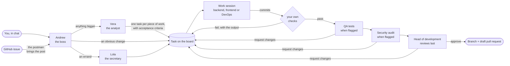

<div align="center">

# Home Office

**Hire a team of AI coding agents, give them a floor, and watch them work your backlog.**

Every repository becomes an office with a team of nine. A boss takes your request, an analyst turns
it into a real specification, a developer builds it, QA, a security engineer and the head of
development review it, and the work comes back as a branch or a pull request — each agent in its own
Docker sandbox, nothing running on your machine.

[](https://github.com/misaon/home-office/actions/workflows/ci.yml)
[](https://github.com/misaon/home-office/releases/latest)
[](LICENSE)


</div>

---

## Why

One coding agent in a terminal is a solved problem. Several of them, on one repository, is not.
Somebody has to turn "the login is slow" into a task another agent can actually finish. Somebody has
to keep two agents off the same branch. Somebody has to run the checks before the diff reaches you,
and send it back when they fail. And once three sessions are running, you have no idea what any of
them is doing until it is over.

Home Office is that somebody. It runs on your Mac, against your repositories, with your provider
subscription — and it shows you the whole thing as a floor you can look at.

## How a request becomes a pull request



Nothing in that chain is a prompt you have to write twice. The boss is told how to route, the analyst
how to specify, the developer how to report, each reviewer what to look for and to produce a verdict
and nothing else — and the daemon, not the model, decides what happens next.

## What you actually get

**A specification, not a paraphrase.** Nobody can hand over a paragraph. The boss routes an errand to
the secretary and an obvious change to the right developer, and hands everything else to the analyst,
who reads the repository and creates the tasks. Delegation takes a goal in one sentence and acceptance
criteria written so that someone else can check them, plus what must not change and what is
deliberately out of scope. If nobody can write a checkable criterion, they ask you instead of guessing.

**Your checks are the gate, and they gate a commit.** Set one command per floor — `bun run check`,
`make test`, whatever you already use. When the agent reports, the office reads the exact commit at
HEAD, refuses a working tree with anything uncommitted or untracked in it, runs your command against
that commit in a network-less sandbox, and publishes that commit and nothing else. The commit is
recorded on the task, every review verdict names it, and a floor with no check command says so on the
task instead of pretending. Failing work never reaches your branch; it goes back to the author with
the real output attached. A floor whose `docker compose` services are part of the checks gets the same
private engine for the verifier that the agent had, warm from the agent's own pulls.

**Review is a chain of separate sessions, and a requested review is never skipped.** Whoever
specifies a task flags whether QA should test it and whether the security engineer should audit it;
the head of development reviews every task last. Each reviewer gets their own copy of the repository
checked out at the verified commit, the base branch and the verdicts before theirs; nothing they
change in that copy can reach the branch, so a fix they want is a finding. They must answer approve or
request changes with numbered findings. Approval passes the commit to the next reviewer; rejected work
returns to the author with the findings, the round is counted, and the chain starts over. When a task
asks for a role nobody on the floor holds, the planner is refused up front, and a task that reaches
review without its reviewer blocks with the reason instead of closing — hire the role, or waive that
one review from the task's card or with `ho task waive <task> qa`.

**Tasks can build on each other.** The analyst passes the ids of the tasks a piece of work needs in
`dependsOn`; the office holds the dependent task until they are done and starts its branch from the
last of them, so the developer already has the result in the tree. The task that depends on all the
others is where the whole request is checked as one.

**Work survives a session ending.** Each task owns a Docker volume: the checkout, the branch, the
provider's state, the build cache. A budget runs out, the daemon restarts, you close the lid — the next
session resumes the same conversation in the same tree, or picks up from the notes if it cannot. The
garbage collector never removes the volume of a task that is still open, however old it is, and it
stops any container whose session the office no longer considers running.

**Budgets are per task and honest about what they can promise.** An agent's turn and dollar budgets
count across every session it spends on a task, including retries after a failed check and rework
after a review; a task that has used them up is set aside for you rather than restarted. Each agent's
card says who enforces each limit: the runtime itself, the office at the next usage report, or nobody,
because that sign-in does not meter spend.

**A floor you can read at a glance.** The office is a top-down plan: reception, the boss's desk, twelve
desks, a kitchen, a meeting room. Each agent is a character that walks it. Work moves as an envelope
carried across the floor, so you can watch a handoff happen. Characters fetch coffee, take breaks and
go home — which sounds like a joke until it is nine at night and you can tell who is still busy without
reading a single log line.

**GitHub, if you want it.** Issues arrive as post at reception, filtered by label. The answer goes back
as a comment, and the branch as a draft pull request.

**Four providers, one office.** Claude Code, OpenCode, Gemini CLI and Codex. Per agent you choose the
provider, the model, the effort, the budget in turns, minutes and dollars, and the skill pack. One
floor can run a Claude boss over a Qwen developer on your own Ollama — the office does not mind.

## The team

Every floor starts with the same nine, each with a skill pack for their part of the chain. Change
their model, effort, budget or prompt, dismiss anyone you do not need, or hire your own; a floor with
no team yet gets it when the daemon starts.

| Who    | Role      | Default (Claude Code) | What they do                                                                           |
| ------ | --------- | --------------------- | -------------------------------------------------------------------------------------- |
| Andrew | boss      | opus, medium          | Reads the chat and the post, routes each request, reports back                         |
| Lola   | secretary | haiku, low            | Small errands — docs, changelog, renames, dependency bumps — and carries the envelopes |
| Vera   | analyst   | opus, high            | Turns a request into tasks with acceptance criteria and assigns them                   |
| Rex    | backend   | sonnet, high          | Server-side code, APIs and data changes                                                |
| Ida    | frontend  | sonnet, high          | What the user sees, checked in the browser                                             |
| Bruno  | devops    | sonnet, high          | Containers, pipelines and infrastructure                                               |
| Otto   | qa        | sonnet, high          | Tests flagged branches against their criteria                                          |
| Sable  | security  | opus, high            | Audits flagged branches for security and performance issues                            |
| Mara   | head      | opus, high            | Reviews every branch last                                                              |

A tenth role, `developer`, is a general developer for whatever the specialists do not cover.

## Requirements

- **macOS 14 or newer on Apple Silicon** for the packaged app: the DMG is built for Apple Silicon
  only. The agent image itself builds for arm64 and amd64, so a daemon run from a source checkout
  works on an x86-64 host too; that path is not packaged and not yet covered by a release.
- **Docker Desktop**, running.
- **Credentials for one provider.** A Claude subscription token from `claude setup-token`, or an API
  key for Anthropic, OpenAI or Google.
- **`gh auth login` on the host**, if you want issue intake or pull requests.

## Install

Download the DMG from the [latest release](https://github.com/misaon/home-office/releases/latest),
check it against `SHA256SUMS.txt`, and drag the app to Applications.

The build carries an ad-hoc signature rather than an Apple Developer ID, so macOS will not recognise
the developer. Clear the quarantine flag once:

```bash
xattr -cr "/Applications/Home Office.app"
```

Right-clicking the app and choosing **Open** works too.

## Your first ten minutes

1. **Open the app.** The office is empty; that is the only thing on screen.
2. **Add a floor.** Point it at a local repository or a Git URL. You get a floor and the team of
   nine: **Andrew** at the boss's desk, **Lola** on reception, and the others at theirs.
3. **Walk the setup checklist.** It verifies Docker, builds the images it needs, and puts your provider
   credentials in the macOS Keychain — never in a file the office can read back.
4. **Meet the team.** Team lists the nine; change a model or a budget, dismiss anyone you do not
   need, or hire your own colleague with a role and a prompt.
5. **Set the gate.** Give the floor your own check command. This is the one setting that decides
   whether the office is useful or merely fast.
6. **Write to the boss.** "The settings dialog loses focus when you press Escape." Watch Lola carry it
   over, watch him think, watch the task appear on the board and Ida walk to her desk.

## Let the repository describe its own floor

Commit a `.ho/config.json` and the floor configures itself wherever it is opened — name, default
branch, publish and intake policy, budgets, and the staff to hire:

```json
{
  "$schema": "https://raw.githubusercontent.com/misaon/home-office/main/schema/office.schema.json",
  "version": 1,
  "name": "Home Office",
  "defaultBranch": "main",
  "publish": { "mode": "pull-request", "draft": true },
  "verify": { "command": "bun run check" },
  "budgets": { "maxTurnsPerTask": 200, "maxConcurrentSessions": 1, "maxWallMinutes": 60 }
}
```

The office applies it when the daemon starts and whenever the file changes;
`ho project export <floor>` writes the floor back out again. `services` takes `enabled`, `mode`
(`rootless` or `rootful`) and `trust`: the private container engine is a privileged container, so it
only starts once the repository is marked `"trust": "trusted"`, in this file, in Settings or with
`ho project set <floor> --trust trusted`. Until then agents are told that services are off and why. An `agents` list names the whole staff:
each entry has a `role` from boss, secretary, analyst, backend, frontend, devops, qa, security, head
or developer, and a floor whose file names no staff keeps the default team. No credential ever goes in
it — only which provider an agent uses, which is enough for the daemon to find the key in the Keychain.
A gitignored `.ho/config.local.json` layers over it for one machine.

## What runs where

The point of the office is that an agent's mistake stays inside a box.

|                                   |                                                                                                                                                                                                                                        |
| --------------------------------- | -------------------------------------------------------------------------------------------------------------------------------------------------------------------------------------------------------------------------------------- |
| **The agent**                     | Its own container: a non-root user, a read-only root filesystem, memory, CPU and PID limits, scratch directories on tmpfs, and no bind mount into your filesystem except a read-only inbox for the files you attach in chat            |
| **Your checkout**                 | Never touched. The repository is cloned into a task volume, and finished work arrives as a new `ho/task-<id>` branch — your working tree and index are exactly where you left them                                                     |
| **Every git operation**           | A separate short-lived container with **no network at all** and hooks disabled                                                                                                                                                         |
| **Your check command**            | The same: no network, a fresh container, the agent's volume at a clean checkout of the commit that gets published; a floor with services gets the task's private engine attached, still without network                                |
| **Every review**                  | Its own volume with the verified commit checked out, separate from the author's; caches and dependencies survive between reviewers, edits go nowhere                                                                                   |
| **Secrets**                       | The macOS Keychain, handed to the sandbox as environment and nowhere else — not in process arguments, Docker labels, the event log or the office's own logs                                                                            |
| **The daemon**                    | Bound to `127.0.0.1` behind a bearer token. Nothing listens outward                                                                                                                                                                    |
| **`docker compose` in your repo** | Optional, and served by a private engine started for that one task, reachable only from that task's sandbox. Your host daemon stays out of reach. The engine is a privileged container, which is why it needs the floor marked trusted |

Every state change in the office is an event appended to a local SQLite log, so the board, the floor
and the usage panel are all views of one history — and you can replay exactly what happened.

## What the office records

Everything stays under `$HO_HOME` (`~/.config/home-office` by default) and is readable without the
daemon:

- **The daemon log.** `ho daemon --debug` writes JSON lines to `$HO_HOME/logs/daemon-<start>.log`
  (rotated at 32 MB, five files kept): every domain event, every RPC and MCP tool call with its
  duration, the timing of each session phase (volumes, checkout, sandbox, runner, verify, push, pull
  request) and a one-line summary when a session ends.
- **The event log.** `ho.db` holds every state change the office ever made.
- **Session traces.** `$HO_HOME/traces/<session id>.jsonl` keeps what each agent saw and did: the
  configuration it ran with and the model the runtime confirmed, the exact system prompt and opening
  message, the complete runtime stream (tool inputs and outputs, usage per turn), the office's
  messages to it and the office's milestones, with the session's credentials and anything shaped
  like a token or a private key replaced before the line is written. `index.jsonl` next to them has
  one summary line per session. Traces older than `retention.traceDays` (30 by default) are removed
  by the office's garbage collector.

Rate delivered work from the task's card or with `ho task rate <task> good|bad --note "…"`. The
verdict is stored on the task and joins the traces when the office's prompts and skills are
evaluated.

## The command line

The desktop app and the `ho` binary talk to the same daemon, so anything you can click you can script:

```bash
ho daemon --ui                         # start the office and print a UI URL
ho doctor                              # Docker, images, credentials, capacity
ho project add app --path ~/code/app   # a new floor for a local repository, with the team of nine
ho agent add Nico --role backend --project app --model sonnet
ho task create --project app --title "Fix the focus trap in the settings dialog" --browser --qa
ho task create --project app --title "Use the new API" --depends-on <task>   # waits for it, builds on it
ho task waive <task> qa                # let a task through a review stage nobody here can give
ho project set app --services on --trust trusted   # allow the privileged engine for this repository
ho agent set Nico --max-usd 5          # per task, across every session, where the provider reports cost
ho session watch                       # live output from every running agent, each line tagged by session
ho usage --since 24h                   # tokens per agent, floor and day
ho remote pair --name phone            # pair a phone through the relay
```

## From your phone

The daemon never listens outward, so remote control works the other way round: the daemon opens
one outbound WebSocket to a small relay, and your phone connects to the same relay. The relay only
forwards ciphertext. Every pairing derives a key with X25519 and HKDF, every frame is sealed with
AES-256-GCM, and both ends prove the pairing secret before a single byte of the office crosses the
wire.

```bash
bun run relay                                   # a relay on 127.0.0.1:47850 (RELAY_HOST, RELAY_PORT)
ho remote on --relay wss://relay.example.com/relay
ho remote pair --name phone                     # a one-time code, valid ten minutes
ho remote status                                # connection, paired devices, open pairings
ho remote revoke phone                          # that device is out, immediately
```

A paired device may chat, read the board and the sessions, create, move and rate tasks and stop a
session. It cannot touch settings, credentials, floors, agents, images or garbage collection; the
daemon refuses those routes before they run. Device keys and the relay key of the office live in
`$HO_HOME/remote.json`, mode 600. The relay in `apps/relay` runs on Bun and has no state of its
own, so it fits a free tier; the browser client that turns the code into a chat window is the next
step, and `bun run spike:remote-tunnel` exercises the whole path today.

## Build from source

```bash
bun install --frozen-lockfile
bun run devkit          # fetch the pinned desktop toolchain
bun run desktop:dev
```

`bun run desktop:build` writes an unsigned app and DMG to `apps/desktop/artifacts/`. For the daemon on
its own, `bun run cli:build` produces `apps/cli/dist/ho`. Contributors should read
[AGENTS.md](AGENTS.md) — it is also what the AI agents working on this repository read.

## Status

Early, and honest about it: version 0.0.x, one supported platform, no automated test suite, and an
application signed ad-hoc. What is in the box works end to end — chat, triage, delegation, sandboxed
work, verification, publication, review, GitHub intake, four providers, budgets and usage accounting —
and it is being used to build itself. Issues and pull requests are welcome.

## License

[MIT](LICENSE).
