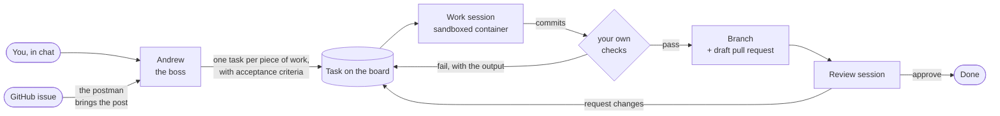

<div align="center">

# Home Office

**Hire a team of AI coding agents, give them a floor, and watch them work your backlog.**

Every repository becomes an office. A boss takes your request, writes a real specification, hands it
to a colleague, and the work comes back as a branch or a pull request — each agent in its own Docker
sandbox, nothing running on your machine.

[](https://github.com/misaon/home-office/actions/workflows/ci.yml)
[](https://github.com/misaon/home-office/releases/latest)
[](LICENSE)


</div>

---

## Why

One coding agent in a terminal is a solved problem. Several of them, on one repository, is not.
Somebody has to turn "the login is slow" into a task another agent can actually finish. Somebody has
to keep two agents off the same branch. Somebody has to run the checks before the diff reaches you,
and send it back when they fail. And once three sessions are running, you have no idea what any of
them is doing until it is over.

Home Office is that somebody. It runs on your Mac, against your repositories, with your provider
subscription — and it shows you the whole thing as a floor you can look at.

## How a request becomes a pull request



Nothing in that chain is a prompt you have to write twice. The boss is told how to specify work, the
worker is told how to report, the reviewer is told to produce a verdict and nothing else — and the
daemon, not the model, decides what happens next.

## What you actually get

**A specification, not a paraphrase.** The boss cannot hand over a paragraph. Delegation takes a goal
in one sentence and acceptance criteria written so that someone else can check them, plus what must
not change and what is deliberately out of scope. If it cannot write a checkable criterion, it asks
you instead of guessing.

**Your checks are the gate.** Set one command per floor — `bun run check`, `make test`, whatever you
already use. It runs in a network-less sandbox against the agent's commits. Failing work never reaches
your branch; it goes back to the author with the real output attached.

**Review is a separate session.** A second agent gets the diff, the base branch and no write access,
and must answer approve or request changes with numbered findings. Rejected work returns to the author
with those findings, and the round is counted.

**Work survives a session ending.** Each task owns a Docker volume: the checkout, the branch, the
provider's state, the build cache. A budget runs out, the daemon restarts, you close the lid — the next
session resumes the same conversation in the same tree, or picks up from the notes if it cannot.

**A floor you can read at a glance.** The office is a top-down plan: reception, the boss's desk, twelve
desks, a kitchen, a meeting room. Each agent is a character that walks it. Work moves as an envelope
carried across the floor, so you can watch a handoff happen. Characters fetch coffee, take breaks and
go home — which sounds like a joke until it is nine at night and you can tell who is still busy without
reading a single log line.

**GitHub, if you want it.** Issues arrive as post at reception, filtered by label. The answer goes back
as a comment, and the branch as a draft pull request.

**Four providers, one office.** Claude Code, OpenCode, Gemini CLI and Codex. Per agent you choose the
provider, the model, the effort, the budget in turns, minutes and dollars, and the skill pack. One
floor can run a Claude boss over a Qwen worker on your own Ollama — the office does not mind.

## Requirements

- **macOS 14 or newer on Apple Silicon.** The agent image is arm64-only; Intel Macs, Linux and Windows
  are not supported yet.
- **Docker Desktop**, running.
- **Credentials for one provider.** A Claude subscription token from `claude setup-token`, or an API
  key for Anthropic, OpenAI or Google.
- **`gh auth login` on the host**, if you want issue intake or pull requests.

## Install

Download the DMG from the [latest release](https://github.com/misaon/home-office/releases/latest),
check it against `SHA256SUMS.txt`, and drag the app to Applications.

The build carries an ad-hoc signature rather than an Apple Developer ID, so macOS will not recognise
the developer. Clear the quarantine flag once:

```bash
xattr -cr "/Applications/Home Office.app"
```

Right-clicking the app and choosing **Open** works too.

## Your first ten minutes

1. **Open the app.** The office is empty; that is the only thing on screen.
2. **Add a floor.** Point it at a local repository or a Git URL. You get a floor, a boss called
   **Andrew**, and **Lola** on reception.
3. **Walk the setup checklist.** It verifies Docker, builds the images it needs, and puts your provider
   credentials in the macOS Keychain — never in a file the office can read back.
4. **Hire someone.** Settings → add a worker and a reviewer, and pick the model and the budget. The
   boss works alone until you do.
5. **Set the gate.** Give the floor your own check command. This is the one setting that decides
   whether the office is useful or merely fast.
6. **Write to the boss.** "The settings dialog loses focus when you press Escape." Watch Lola carry it
   over, watch him think, watch the task appear on the board and a colleague walk to a desk.

## Let the repository describe its own floor

Commit a `.ho/config.json` and the floor configures itself wherever it is opened — name, default
branch, publish and intake policy, budgets, and the staff to hire:

```json
{
  "$schema": "https://raw.githubusercontent.com/misaon/home-office/main/schema/office.schema.json",
  "version": 1,
  "name": "Home Office",
  "defaultBranch": "main",
  "publish": { "mode": "pull-request", "draft": true },
  "verify": { "command": "bun run check" },
  "budgets": { "maxTurnsPerTask": 60, "maxConcurrentSessions": 1, "maxWallMinutes": 60 }
}
```

The office applies it when the daemon starts and whenever the file changes;
`ho project export <floor>` writes the floor back out again. No credential ever goes in it — only which
provider an agent uses, which is enough for the daemon to find the key in the Keychain. A gitignored
`.ho/config.local.json` layers over it for one machine.

## What runs where

The point of the office is that an agent's mistake stays inside a box.

|                                   |                                                                                                                                                                                                                             |
| --------------------------------- | --------------------------------------------------------------------------------------------------------------------------------------------------------------------------------------------------------------------------- |
| **The agent**                     | Its own container: a non-root user, a read-only root filesystem, memory, CPU and PID limits, scratch directories on tmpfs, and no bind mount into your filesystem except a read-only inbox for the files you attach in chat |
| **Your checkout**                 | Never touched. The repository is cloned into a task volume, and finished work arrives as a new `ho/task-<id>` branch — your working tree and index are exactly where you left them                                          |
| **Every git operation**           | A separate short-lived container with **no network at all** and hooks disabled                                                                                                                                              |
| **Your check command**            | The same: no network, a fresh container, the agent's volume                                                                                                                                                                 |
| **Secrets**                       | The macOS Keychain, handed to the sandbox as environment and nowhere else — not in process arguments, Docker labels, the event log or the office's own logs                                                                 |
| **The daemon**                    | Bound to `127.0.0.1` behind a bearer token. Nothing listens outward                                                                                                                                                         |
| **`docker compose` in your repo** | Optional, and served by a private engine started for that one task, reachable only from that task's sandbox. Your host daemon stays out of reach                                                                            |

Every state change in the office is an event appended to a local SQLite log, so the board, the floor
and the usage panel are all views of one history — and you can replay exactly what happened.

## The command line

The desktop app and the `ho` binary talk to the same daemon, so anything you can click you can script:

```bash
ho daemon --ui                         # start the office and print a UI URL
ho doctor                              # Docker, images, credentials, capacity
ho project add app --path ~/code/app   # a new floor for a local repository
ho task create --project app --title "Fix the focus trap in the settings dialog"
ho session watch                       # live output from every running agent
ho usage --since 24h                   # tokens per agent, floor and day
```

## Build from source

```bash
bun install --frozen-lockfile
bun run devkit          # fetch the pinned desktop toolchain
bun run desktop:dev
```

`bun run desktop:build` writes an unsigned app and DMG to `apps/desktop/artifacts/`. For the daemon on
its own, `bun run cli:build` produces `apps/cli/dist/ho`. Contributors should read
[AGENTS.md](AGENTS.md) — it is also what the AI agents working on this repository read.

## Status

Early, and honest about it: version 0.0.x, one supported platform, no automated test suite, and an
application signed ad-hoc. What is in the box works end to end — chat, triage, delegation, sandboxed
work, verification, publication, review, GitHub intake, four providers, budgets and usage accounting —
and it is being used to build itself. Issues and pull requests are welcome.

## License

[MIT](LICENSE).
