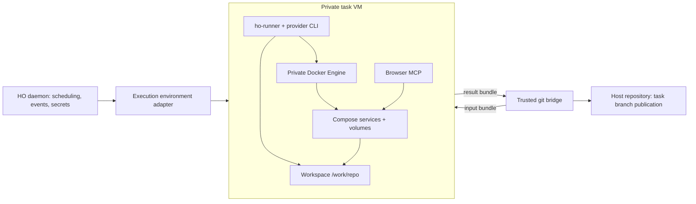

# Task environments with Docker Compose

**Date:** 2026-09-09. **Status:** implementation proposal; no runtime changes or new dependencies.
Requested by the owner: investigate repositories that need Docker Compose while an HO agent is already
running in a container. External sources below were read on this date; release dates are stated
separately. Compatibility and performance gates remain unverified locally.

## Recommendation

Keep today's restricted Docker container for ordinary tasks. Add an opt-in **VM-backed task environment
with its own Docker Engine** for tasks that need Compose, image builds or container-based integration
work. Run the agent, its workspace, browser tools and project containers inside that boundary. Never
give an agent the host Docker socket.

Evaluate **Docker Sandboxes (`sbx`) first**, behind a new execution-environment port. Its latest stable
release observed was **0.42.1, published 2026-09-07**. Version 0.42.0 added creation without a host
workspace mount, which fits HO's repository isolation. This is a proposed backend, not a claim that HO
already supports it. [Release notes](https://docs.docker.com/ai/sandboxes/release-notes/),
[release artifacts](https://github.com/docker/sbx-releases/releases/tag/v0.42.1).

If its integration gates fail, use **one dedicated Lima VM with Docker per environment** on macOS.
Do not implement both backends initially. The architectural decision is a private engine behind a VM
boundary; the first implementation is conditional on the spike. Lima's VZ driver uses Apple's
Virtualization.framework and is the macOS default. [Lima VZ](https://lima-vm.io/docs/config/vmtype/vz/).

DinD is not inherently the wrong mechanism. The question is **which isolation boundary contains its
privileges**. Docker's `-docker` sandbox templates themselves run a privileged environment inside their
microVM. That is materially different from adding a privileged DinD container to the Docker Desktop
engine shared by every HO task. [Sandbox templates](https://docs.docker.com/ai/sandboxes/customize/templates/).

## What the repository does today

| Evidence                                      | Current behavior and consequence                                                                                                                                                |
| --------------------------------------------- | ------------------------------------------------------------------------------------------------------------------------------------------------------------------------------- |
| `images/agent/Dockerfile:9`                   | Installs the agent/browser toolchain, but no Docker Engine, Docker CLI or Compose.                                                                                              |
| `packages/daemon/src/session-run.ts:47`       | UID 1000, read-only rootfs, tmpfs, resource limits, task/provider-state volumes, `binds: []`. No host socket.                                                                   |
| `packages/sandbox-docker/src/provider.ts:51`  | Drops all capabilities and sets no-new-privileges. Simply installing `dockerd` does not make this a working DinD environment.                                                   |
| `packages/sandbox-docker/src/provider.ts:150` | Shared `ho-agents` bridge disables inter-container communication. It is not a ready-made Compose service network.                                                               |
| `packages/daemon/src/git-bridge.ts:11`        | Workspace is `/work/repo`; a separate networkless bridge imports/publishes it through a task volume. Only the bridge receives the source-repository bind mount.                 |
| `packages/core/src/sandbox.ts:17`             | `SandboxSpec` describes Docker containers, mounts and networks; `SandboxProvider.id` is literally `"docker"`. A VM backend cannot honestly implement every operation unchanged. |
| `packages/daemon/src/sessions.ts:177`         | A session owns one sandbox handle, which is stopped and removed in `finally`. Ending the agent process currently ends its compute environment.                                  |
| `packages/daemon/src/launch.ts:48`            | Creates one Docker provider; gateway/MCP URLs use Docker host addressing. Recovery, resources and GC assume that provider.                                                      |
| `packages/daemon/src/gc.ts:20`                | Collects known HO containers, volumes and images. It does not inventory a private engine or VM.                                                                                 |

Thus **nested Docker/Compose is not supported now**. This conclusion comes from source inspection,
not from executing a Compose workload. `sbx` and `limactl` were not on this machine's PATH during this
task. Existing runtime adapters and event sourcing are valuable and should remain.

## Alternatives considered

The verdicts are HO-specific engineering judgments, not vendor guarantees.

| Approach                                            | Fit and decision                                                                                                                                                                                                                                                                                                                                                                                                     |
| --------------------------------------------------- | -------------------------------------------------------------------------------------------------------------------------------------------------------------------------------------------------------------------------------------------------------------------------------------------------------------------------------------------------------------------------------------------------------------------- |
| Mount host Docker socket (Docker-outside-of-Docker) | Small apparent change, but the agent controls the daemon's other containers, mounts and resources. Compose project names and labels are organization, not authorization. Reject. Docker documents daemon-control risks in [Engine security](https://docs.docker.com/engine/security/).                                                                                                                               |
| Socket proxy or HO-managed sibling services         | Viable for a small, typed service catalog. General Compose needs build, exec, mounts and networking; endpoint allowlists alone cannot restrict request bodies or ownership. A complete broker would become a security-sensitive orchestration product. Defer unless the desired scope becomes only curated services such as Postgres/Redis.                                                                          |
| Ordinary privileged DinD, including a sidecar       | Private Docker metadata, but a privileged outer container on the shared engine weakens the current boundary. It also introduces shared-path and nested-storage work. Reject as the default.                                                                                                                                                                                                                          |
| Rootless DinD                                       | Rootless is useful defense in depth, not a substitute for the outer boundary. Docker's documented rootless-in-rootful recipe still requires `--privileged` to relax seccomp, AppArmor and mount masks. [Rootless tips](https://docs.docker.com/engine/security/rootless/tips/).                                                                                                                                      |
| Sysbox / Docker Desktop ECI                         | Real options for system containers. Sysbox CE targets supported Linux hosts; ECI integrates Sysbox into Desktop and requires Business. Consider an explicitly supported ECI deployment later; do not silently depend on the user's global Desktop security setting. [Sysbox](https://github.com/nestybox/sysbox), [ECI](https://docs.docker.com/enterprise/security/hardened-desktop/enhanced-container-isolation/). |
| Docker Sandboxes                                    | Best first experiment for this macOS Apple Silicon app: private engine, VM boundary, lifecycle CLI and network controls. Requires integration work and acceptance of the limitations below.                                                                                                                                                                                                                          |
| Lima + Docker                                       | Practical local fallback with a named VM per environment. HO must supply image provisioning, mounts policy, networking, recovery and resource accounting. A shared default Lima/Colima VM does not provide per-task isolation. [Lima Docker examples](https://lima-vm.io/docs/examples/), [instance creation](https://lima-vm.io/docs/reference/limactl_start/).                                                     |
| Podman machine                                      | Possible VM host, but `podman compose` delegates to an external Compose provider. It adds a compatibility variable for repositories expecting Docker. Prefer Docker Engine for the first backend. [Podman Compose](https://docs.podman.io/en/latest/markdown/podman-compose.1.html).                                                                                                                                 |
| Firecracker / cloud execution                       | Relevant to a future Linux/cloud executor. Firecracker needs Linux KVM; adding a nested Linux hypervisor is not the first choice for this native macOS app. [Firecracker prerequisites](https://github.com/firecracker-microvm/firecracker/blob/main/docs/getting-started.md). Cloud also needs HO's deferred remote transport and credential design.                                                                |

## Why `sbx` is a candidate, not an immediate migration

- It is a standalone CLI; current documented macOS requirements are Sonoma 14+ and Apple Silicon.
  Docker sign-in is part of setup. Its CLI is free including commercial use, while organization
  governance is separately paid. The runtime repository identifies its license as proprietary. Keep
  it an external optional prerequisite rather than silently bundling it into HO's MIT distribution.
  [Installation](https://docs.docker.com/ai/sandboxes/install/),
  [product overview](https://docs.docker.com/ai/sandboxes/),
  [repository license](https://github.com/docker/sbx-releases).
- Customization is Early Access and kits are experimental. Use a pinned HO-owned kit/image; do not
  launch the vendor's Claude/Codex interactive flow and attempt to scrape it. HO must still drive
  `ho-runner` and the existing Claude/ACP adapters. A sandbox kit can define its own entrypoint.
  [Customization](https://docs.docker.com/ai/sandboxes/customize/),
  [kit specification](https://docs.docker.com/ai/sandboxes/customize/kit-reference/).
- Existing Alpine images are not drop-in templates. Sandbox images require an `agent` user, sudo and
  proxy handling. Prototype from a digest-pinned `shell-docker` base and reproduce HO's provider pins
  for that OS, including Bun, Chromium, RTK and browser MCP. Verify all provider variants; do not copy
  the Alpine APK or musl download recipe into an Ubuntu image.
- Template storage is separate from Docker Desktop's image store. Use a verified local image archive
  import (`sbx template load`) or an explicitly configured registry; a local `ho/agent:dev` tag is not
  sufficient. Never turn a task VM into a reusable template: it may contain source, history and secrets.
  [Template distribution](https://docs.docker.com/ai/sandboxes/customize/templates/).
- Local `sbx volume` is not an equivalent of Docker named volumes: the CLI documents those volume
  operations as cloud-only. Plan local resume around retaining a stopped environment or exporting
  explicit state. [CLI reference](https://docs.docker.com/reference/cli/sbx/).
- `sbx env` is experimental and can perform host lifecycle actions. Do not automatically run a
  repository's `.sbxenv.yaml`, kit, or host MCP configuration. Compose remains repository content
  evaluated inside the VM. [Environment files](https://docs.docker.com/ai/sandboxes/configuration/environment-files/).

## Target topology and ownership

This is a logical boundary diagram; backend-internal containers are omitted. **The VM, not the agent
process, is the unit that owns Docker state.** Treat its contents as one trust domain: an agent with
engine access can inspect its project containers and read data available inside that environment.

Use an environment ID distinct from the task and session IDs, bound to project, task, agent, provider
and generation. Only one session may lease it at a time. A resumed writer may reuse its own stopped
environment; a reviewer or a different task receives a fresh environment from the selected commit.
Do not share a mutable workspace, Docker socket or database volume between parallel tasks. Changing
backend/provider cannot silently reuse an incompatible resume handle.

Persist allocation intent before provisioning, then the provider handle and state after each successful
step. Proposed states: `allocating`, `ready`, `running`, `stopping`, `retained`, `deleting`, `failed`.
These are new environment states, not replacements for task/session states. Events carry ownership,
backend, timestamps, resource policy and safe failure codes, never credentials or engine endpoints
containing authentication. Reconcile observed provider state after daemon restart before scheduling.

## Workspace import and publication

Keep the host repository outside the agent boundary. Prefer **mountless creation plus Git bundles**
over a live host worktree mount. `sbx create` without a workspace and `sbx cp` provide the basic
primitives; the bundle workflow itself is a proposed HO implementation.
[Create](https://docs.docker.com/reference/cli/sbx/create/),
[copy and lifecycle operations](https://docs.docker.com/ai/sandboxes/usage/).

1. The trusted bridge exports the selected base/task branch into a daemon-owned transfer area. Copy
   that immutable input into the environment and materialize `/work/repo` there. Keep today's
   committed-source semantics; do not implicitly include the owner's uncommitted working tree.
2. Run both Compose's CLI and its engine where `/work/repo` resolves to the same working files.
   `build: .`, `volumes: [".:/app"]`, file watching and file ownership are required acceptance cases.
   Docker resolves bind sources on the **daemon** side, so a remote engine or sidecar with no matching
   filesystem would fail. [Bind mounts](https://docs.docker.com/engine/storage/bind-mounts/).
3. Finish the agent, quiesce services that can write the workspace, then export a bounded result
   bundle for the expected commit/ref. Ensure export uses a stable filesystem view; the spike must
   establish an enforceable quiesce/snapshot sequence before claiming consistent publication.
4. Import untrusted results into a fresh quarantine repository in the networkless bridge. Disable
   hooks, fsmonitor and ambient Git configuration; validate object integrity, expected refs, ancestry
   policy and size limits. Never import the guest's `.git/config`, hooks or executable host settings.
   Handle submodules and Git LFS explicitly: either support their materialization inside the VM or
   report the unsupported case, rather than claiming bundles contain external objects.
5. Publish only the daemon-selected task ref through the existing bridge policy, then record the
   artifact/delivery outcome. Preserve retry state if export, import or host publication fails.
   Do not mark successful completion first and discover a failed publication later.

Dirty/untracked work and provider conversation state are not represented by a commit bundle. Retain
the stopped writer VM on interruption so these survive, and show their retention deadline. A fresh
review receives published source, not the writer's tools or environment state. Any future portable
checkpoint format needs its own bounded file-transfer rules; do not copy arbitrary guest trees onto
the host. Transfer areas are owner-only, not executable, excluded from GC while leased and cleaned
after publication or explicit discard.

## Networking, ports and credentials

Compose service DNS exists inside its project network. An agent/browser outside that network should
use a service port published into the task VM; it must not assume that `db` or `web` resolves from
every process. A host preview adds another mapping: service → task VM port → ephemeral host loopback
port. The same repository can use the same internal port in concurrent VMs without colliding.
Expose previews through a scoped HO operation and return the observed URL; refresh it after restart.
Do not publish databases or Docker APIs to the host automatically. Docker documents local forwarding,
ephemeral allocation and host-service access in [development workflows](https://docs.docker.com/ai/sandboxes/workflows/development/).

For the existing runner WebSocket and HTTP MCP, verify `host.docker.internal` through the sandbox
proxy with an allow rule for the exact HO loopback port. Keep HO's server bound to loopback and retain
its distinct runner/MCP authentication; no global daemon token enters the VM. Derive these URLs per
backend instead of using `config.docker.gatewayHost` everywhere. Validate WebSocket upgrade, streaming,
timeouts and proxy environment inheritance with real provider sessions. Mint the short-lived runner
connection token only after slow VM/image provisioning has completed.

If the proxy cannot carry this transport, add a local managed transport/relay behind the same runner
channel abstraction. Do not solve it by binding the daemon to `0.0.0.0` or allowing all host ports.
The local network-policy scope must be verified: do not widen every sandbox's policy merely to start
one task. Unknown or centrally denied policy produces a setup failure, not an automatic allow-all.

Preserve HO's child-process credential delivery for the first implementation. Bootstrap runner secrets
through a private transient channel, not `sbx` command arguments, kit arguments, image metadata or
durable environment configuration. Root inside this VM can inspect its own processes; this is no
promise to hide credentials from the authorized agent. Do not register the full HO secret store with
`sbx`. Proxy-based provider credential injection can be evaluated separately for compatible API-key
and subscription flows.

Disable shared skills and inspect all effective mounts. Docker documents a shared writable skills
store and a per-sandbox opt-out; mountless alone does not prove the absence of other shared state.
Keep HO's role packs immutable and browser stdio MCP inside the task environment. Do not use a host
stdio MCP bridge to execute repository code. [Default posture](https://docs.docker.com/ai/sandboxes/security/defaults/),
[MCP trust boundary](https://docs.docker.com/ai/sandboxes/security/).

Enforce egress outside the VM where the agent cannot remove it. Check provider APIs, registry/CDN
pulls, package registries and repository downloads. Document blocked UDP/ICMP and unsupported network
workloads; do not advertise arbitrary networking compatibility. Some kit network patterns are parsed
but not yet enforced, so only claim controls verified in the pinned runtime. [Network isolation](https://docs.docker.com/ai/sandboxes/security/isolation/),
[kit policy support](https://docs.docker.com/ai/sandboxes/customize/kit-reference/).

## Limits, retention and failure handling

Budget **the whole environment**, including engine, builds, services and browser. Agent-container
limits alone would miss its sibling workloads. Set explicit outer CPU and RAM limits; bound both root
disk and Docker data disk, transfer sizes, logs, concurrent starts and running VMs. Measure the actual
enforcement, not merely acceptance of CLI flags. Guest PID limits are defense in depth because an
agent with root/engine access can change guest policy. Require host-enforced compute/disk bounds and
an independent stop path. `sbx create` exposes CPU/RAM flags; do not inherit its automatic defaults.
[Create resource options](https://docs.docker.com/reference/cli/sbx/create/).

Stop compute when a session pauses, finishes, waits for review or exhausts its wall-time budget.
Revoke its runner/MCP access and preview forwards. Retain disk only under an explicit last-used
retention policy, separate from active compute limits. Preserve interrupted/unpublished work until
the configured retention deadline or explicit discard, making that deadline visible.

`compose down` is cooperative convenience, not the cleanup boundary. A repository can start containers
outside Compose or leave background processes. The adapter must stop/remove the whole environment
even when the guest is unresponsive. Confirm which disk, image-cache and port artifacts remain after
removal; immutable backend caches require their own accounting. Never use global `sbx prune/reset`
or host `docker system prune` as HO cleanup. [Sandbox lifecycle](https://docs.docker.com/ai/sandboxes/get-started/).

A persisted ownership record plus deterministic allocation identity must cover a crash between remote
creation and receipt of its handle. Retry stop/delete idempotently, reconcile incomplete allocations,
and surface cleanup failures instead of discarding them. Protect live leases and publication retries
from GC. If the backend disappears, block affected tasks while preserving their recoverable state.

## Implementation sequence

All items are open. The owner's current request authorizes this plan, not installing a new runtime
or changing the sandbox implementation. Future validation cases below are acceptance requirements;
this task adds no tests or code comments.

### A. Compatibility spike — decide whether to adopt `sbx`

- [ ] Pin a supported stable CLI, artifact checksum and base-image digest. Record local help/version
      output and license/distribution choice in STACK; never pin a moving `latest` tag.
- [ ] Prove a mountless HO-controlled environment can run the actual runner and provider protocol
      non-interactively. Verify custom kit requirements, image import and no shared host state.
- [ ] Prove input/result bundle transfer, interrupted dirty-work retention and a consistent export.
- [ ] Exercise Compose build, relative bind mount with a visible live edit, database health/readiness,
      browser access, and isolated concurrent copies with identical service/container names and ports.
- [ ] Verify scoped host gateway/MCP connectivity, credentials, cancellation and all provider modes.
- [ ] Measure enforced CPU/RAM/root-disk/Docker-disk budgets and recovery after HO and backend restart;
      record cold start, warm resume, peak memory and reclaimed disk without predicting benchmark values.
- [ ] Verify local unattended operations, machine-readable inventory where supported, stable ownership
      identification, timeout/kill behavior and deletion without touching a user's unrelated sandboxes.

**Go/no-go:** adopt only if isolation, runner transport, repository publication, outer limits and
cleanup are demonstrated. A missing cosmetic UI capability is not a blocker; a missing hard boundary
is. If a gate fails, record it and run the same spike on Lima/VZ with Docker, no default home mounts,
no forwarded host Docker socket and explicit networking. Recheck Lima's release/artifact pins then;
do not select an unmeasured version here.

### B. Add a narrow execution-environment port

- [ ] Keep `SandboxProvider` as the existing low-level Docker/bridge adapter. Introduce a pure
      environment port in `packages/core` for capabilities, prepare, start/connect runner, stop, retain,
      export, remove and inspect. Avoid pretend Docker volumes/networks for a VM implementation.
- [ ] Add Zod-backed backend selection and environment identity/events to `packages/protocol`, domain
      commands/projections to `packages/core`, and persistence changes to `packages/store` if required.
      Historical sessions default explicitly to the Docker backend on replay.
- [ ] Wrap the existing path as `docker-container`; add only the selected VM adapter, provisionally
      `packages/sandbox-sbx`. No provider-specific I/O goes into core or sim.
- [ ] Rework `session-run.ts`, `sessions.ts`, `launch.ts` and `Provisioned` to lease environments and
      derive workspace/transport addresses from them. Keep Claude/ACP and office MCP behavior intact.

### C. Workspace, recovery and resources

- [ ] Extend `git-bridge.ts` and publication orchestration with bounded bundle import/export and the
      isolation checks above. Preserve publication-before-success ordering in `settle.ts`.
- [ ] Extend startup recovery, `gc.ts`, resource RPC/protocol and the Resources UI to cover VM handles,
      retained disks, leases, previews and cleanup errors. Do not reuse Docker-only pruning assumptions.
- [ ] Add explicit aggregate scheduling budgets alongside existing session concurrency. Charge
      provisioning and running environments, release compute reservations only after confirmed stop.
- [ ] Provision provider state per environment/agent; verify resume and re-review without sharing
      mutable state across tasks. Keep the old backend working throughout the rollout.

### D. Compose capability and user flow

- [ ] Project setting: `containerEngine: disabled | isolated`, with a task override. The VM backend is
      chosen by trusted HO configuration; repository discovery cannot enable privileges or host mounts.
- [ ] Detect standard Compose filenames as a hint and allow an explicit relative path/profile for
      monorepos. Validate path containment and symlinks inside the workspace. Detection does not imply
      automatic startup or permission to execute a repository's host-side hooks.
- [ ] Expose environment state and a precise setup error in UI/CLI. If the capability is absent,
      block with the reason; never fall back to the host socket. Changing modes restarts execution from
      preserved work under an explicit transition, not live privilege escalation of the current container.
- [ ] Tell the agent its workspace, Docker capability, limits and preview mechanism. Let normal
      `docker compose` run inside the VM. Optional HO start/status/stop tools call structured argv there;
      never interpolate model output into a daemon shell.
- [ ] Resolve Compose config inside the environment, with only intended env inputs. For managed
      startup, use the pinned CLI's readiness/deadline options; report running versus healthy distinctly.
      `--wait` only waits for running/healthy, so a service with no healthcheck is not proven application-ready.
      [Compose up](https://docs.docker.com/reference/cli/docker/compose/up/).
- [ ] State compatibility limits: host-absolute mounts, external volumes/networks and host devices are
      not imported; host-network mode refers to the guest boundary. ARM64-native images are the initial
      target. Explicitly measure any amd64 emulation before promising it.

### E. Release acceptance

| Scenario                                                | Required evidence                                                                                                                      |
| ------------------------------------------------------- | -------------------------------------------------------------------------------------------------------------------------------------- |
| Existing task without engine                            | Current runner, provider auth, publication and cleanup still work.                                                                     |
| Compose application + database                          | Build, writable source mount, healthcheck, migration, browser request and logs work inside the VM.                                     |
| Concurrent copies of a repository                       | Independent DB contents, Docker listings and previews; no port/name collisions across environments.                                    |
| Host/cross-task access attempt                          | No host repo/socket, shared skills or other task state reachable through mounts or container API. Network controls checked separately. |
| Out-of-band containers and background writers           | Whole-environment stop works; export has a stable view; no child compute escapes cleanup.                                              |
| Failure during create/pull/build/export/publish/delete  | State is recoverable, retries are bounded/idempotent, and completion is not falsely reported.                                          |
| Daemon crash, runtime restart, host sleep               | Reconciliation runs before reuse; stale leases/tokens/preview URLs are not trusted.                                                    |
| CPU/RAM/disk exhaustion                                 | Host-enforced bounds hold and another task remains usable; record measured results.                                                    |
| Interrupted writer, resumed writer, fresh reviewer      | Dirty state retained for writer; reviewer gets the selected source in a fresh environment.                                             |
| Missing login/runtime, denied egress, unsupported image | Actionable failure; no silent weaker backend.                                                                                          |

Run existing relevant verification and `bun run check` before implementation commits. Record exact
commands and real output in `audit/VERIFICATION.md`, including failed gates. Tests/comments remain
subject to the owner's task-specific instructions. Promote this feature out of opt-in only after
representative repositories and the recovery cases pass.

## Verification of this planning task

Repository evidence was inspected read-only. Semantic discovery returned an upstream HTTP 404, so the
explorer used direct source inspection. Primary vendor documentation and release artifacts support
the external facts; the proposed HO design and acceptance conditions are our conclusions.
No VM, DinD or Compose workload was launched, no performance result is claimed, and no runtime was
installed. The documentation check/commit evidence is recorded in `audit/VERIFICATION.md`.
